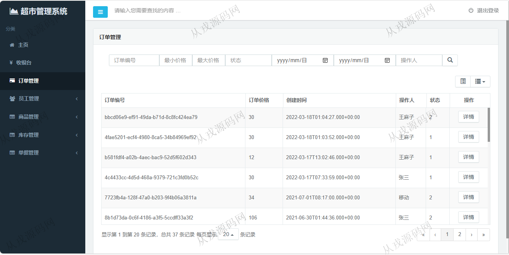
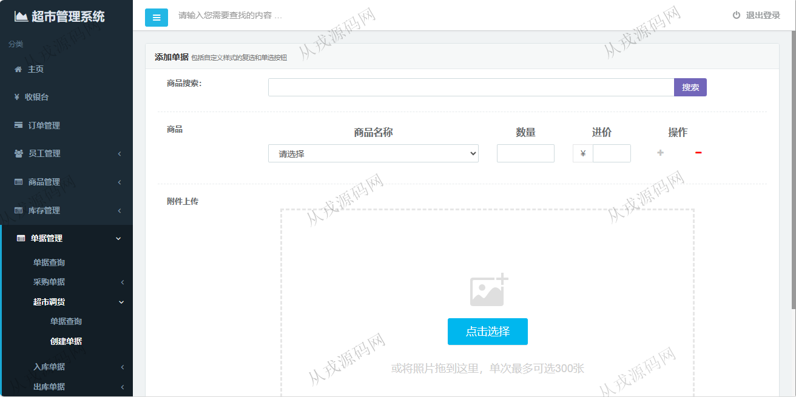

<p><h1 align="center">95.超市收银管理系统</h1></p>

<p> 获取sql文件 QQ: 386869957 QQ群: 377586148 </p>
<p> [推荐站点: 从戎源码网](https://armycodes.com/) </p>

## 简介

> 本代码来源于网络,仅供学习参考使用!
>
> 提供1.远程部署/2.修改代码/3.设计文档指导/4.框架代码讲解等服务
> 
> 登录地址：http://localhost:8080/login
> 
> 管理员：root 123456
> 
> 收银员：lianto 123456
> 
> 仓库管理员：xiaoguang 123456
>

## 项目介绍
基于springboot的超市收银管理系统：前端 Thymeleaf、Ajax、jquery、Echarts，后端 maven、spring、Shiro、Mybatis，角色分为管理员、收银员、仓库管理员；集成收银记录出纳、超市的流水、销售统计等功能于一体的系统。

本系统是基于B/S架构的超市管理系统，为了解决超市对雇员，对商品的管理，提高工作效率而开发。
本系统具有收银记录出纳的功能，记录超市的流水、销售统计功能，可以分类查询某时间段某具体产品的收益，售出情况，对商品进行分类管理，系统可以管理分类，增加分类，修改分类信息，删除分类，可以对商品库存进行管理，实现对商品的模糊查询，分类查询，按生产日期查询，并能对商品进行添加库存，还可以新建商品，修改商品属性，删除商品，此外还有过滤器对访问权限的管理，只有登录系统才可以访问系统页面。

## 功能介绍

- 主页：同比增长，销售金额，日成交量，周销售数据，分类销售数据
- 收银台：商品搜索，结算清单，挂单，结算
- 订单管理：订单列表查询，订单详情查看
- 员工管理：用户信息的增删改查，角色信息的增删改查
- 商品管理：商品信息的增删改查，多条件搜索查询
- 分类管理：分类信息的增删改查
- 库存管理：库存查询，入库，出库
- 单据管理：单据查询，采购单据，超市调货，入库单据，出库单据

#### 使用说明

二维码生成
文件位置项目 resources/lib

```
安装
mvn install:install-file -Dfile=e:\QRCode-3.0.jar -DgroupId=QRCode -DartifactId=QRCode -Dversion=3.0 -Dpackaging=jar 
```

## 环境

- <b>IntelliJ IDEA 2021.3</b>

- <b>Mysql 5.7.26</b>

- <b>Redis 3.0</b>

- <b>JDK 1.8</b>

## 运行截图








